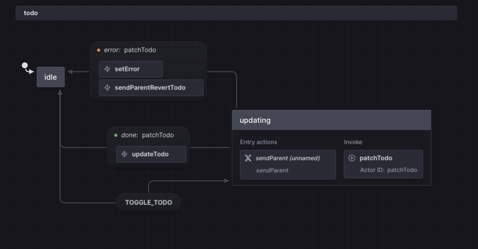
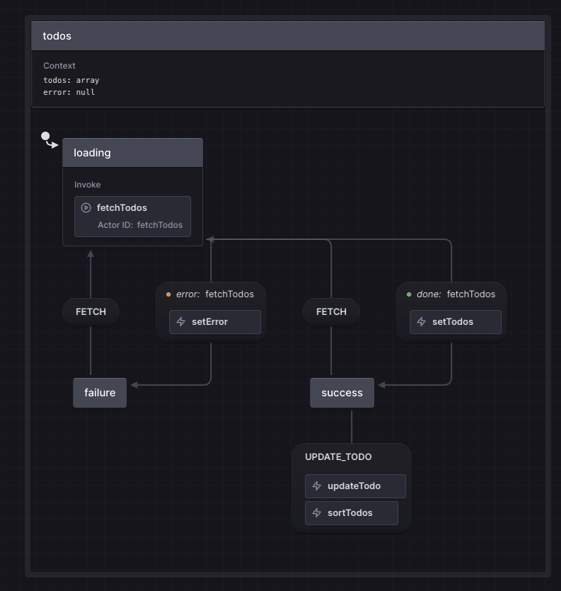

# Endpoint Todos

This project uses the react-ts vite template to bootstrap a React + TypeScript project. This was built as part of an application for the Senior Software Engineer position at Endpoint.com.

## Getting Started

To run the application:

```bash
git clone https://github.com/KrisCoulson/endpoint-todos-app.git

npm install

npm run dev

navigate to http://localhost:5173/
```

## Technical Decisions

#### Tests
I only wrote a few tests to make sure that my sorting was working as expected. Given time constraints I did not write tests for mocking the fetch request or rendering UI components.

The tests can be ran with `npm run test`

#### CSS
Typically I use tailwindcss. Given the size of this project I thought it was overkill to add it. 

#### State Management
Beyond the default packages installed with Vite, XState was added for state management. While this project is relatively straightforward and could function without a state manager, XState was chosen because:
- It reduces potential for bugs
- Enables faster feature development
- Provides a solid foundation for future enhancements
- Advanced Type management for events and transitions
- And provides a great way to visualize complex logic


### State Machine Visualization
Below is the visualization of the application's state machines.

The visiualizer can be found [here](https://stately.ai/registry/editor/48ca5564-b575-4532-80a1-f9e57a48a43a?mode=design&machineId=fada747b-6323-4316-a1fb-e0682870edcc) you can interactively navigate through the different states.

### todoMachine
The todoMachine is responsible for updating individual todos. It supports optimistic updates, allowing for immediate visual feedback, but also provides the capability to rollback in case of an error from the patch request. As it transitions to an updating state, it helps prevent repeated clicking on the checkbox and displays a loading icon while waiting for the server response.


### todosMachine
The todosMachine manages the fetching of initial todos and handles the overall todos state, covering scenarios of loading, success, or errors.
